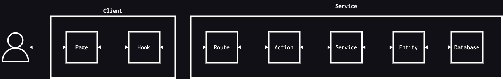

# Project Structure

Learn about how a Volca project is structured.

```
my-volca-project/
├─ clients/
│  ├─ web/
│  │  ├─ src/
│  │  │  ├─ components/ (contains UI components such as buttons and forms)
│  │  │  ├─ hooks/ (contains hooks used to manipulate state, call APIs etc)
│  │  │  ├─ layouts/ (contains layout components)
│  │  │  ├─ pages/ (contains pages that correspond to a route in the app)
│  │  │  ├─ routing/ (components for routing)
│  │  │  ├─ state/ (state management)
│  │  │  ├─ theme/ (theme and styling configuration)
├─ services/
│  ├─ api/
│  │  ├─ src/
│  │  │  ├─ actions/ (contains functions that are called from routes)
│  │  │  ├─ email-templates/ (templates for emails sent from the app)
│  │  │  ├─ entities/ (entities used for interacting with the database)
│  │  │  ├─ errors/ (definitions of all errors that can be thrown by the service)
│  │  │  ├─ lambda-handlers/ (defines the Lambda functions that runs the service)
│  │  │  ├─ middlewares/ (middlewares for the API endpoints)
│  │  │  ├─ services/ (classes that manipulate data and hold application logic)
│  │  │  ├─ utils/ (generic utilities)
```

## Call Stack



## Monorepo

Volca is structured as a monorepo. This means the code for both backend and frontend is in the same repository. The reasons for choosing to build Volca as a monorepo are:

- One repository to pull every time you want to build a new feature
- A Pull Request can include changes in both the frontend and the backend
- Configuration files for code formatting, linting etc. can be kept in sync easier
- Automated jobs can be configured and triggered in a single place

This structure is made possible by using [Yarn Workspaces](https://yarnpkg.com/features/workspaces)

### Frontend

All frontend apps reside in the `/clients` folder. When you download Volca for the first time, there will be a single app - `web`. This is the default customer dashboard that you get with Volca which includes authentication, payments, project management and user settings. If you would like to add a separate application, for example an internal dashboard, you simply create a new React app in the `/clients` folder.

### Backend

All backend services reside in the `/services` folder. When you download Volca for the first time, there will be a single service - `api`. This is the default API that powers the customer dashboard. If you want to create a new service, simply create another one in the `/services` folder.
